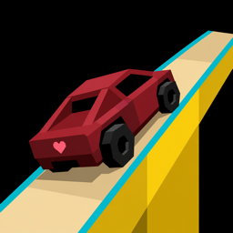

<p align="center">
  
</p>

<h1 align="center">Stunt Car Racer for Lovers</h1>

<p align="center">
  <strong>The classic jump. Shared.</strong><br>
  Geoff Crammond’s elevated stunt circuit — rebuilt for today,<br>
  still flat-shaded, still that stomach-lift moment over the gap.
</p>

<p align="center">
  <a href="https://nmarchand73.github.io/StuntCarRacerForLovers/play/"></a>
  &nbsp;
  <a href="https://nmarchand73.github.io/StuntCarRacerForLovers/#download"></a>
  &nbsp;
  <a href="https://github.com/nmarchand73/StuntCarRacerForLovers"></a>
</p>

<p align="center">
  <code>Web</code> · <code>macOS</code> · <code>Windows</code> · <code>Linux</code>
  &nbsp;·&nbsp;
  <code>U</code> Amiga+ &nbsp;·&nbsp; <code>I</code> Speed feel &nbsp;·&nbsp; <code>O</code> Enhanced Look &nbsp;·&nbsp; <code>N</code> Menu music
</p>

---

## Play in thirty seconds

No install required — open the browser build, pick a track, hit **Enter**.

| Platform | Get it |
|:---------|:-------|
| **Browser** | **[Play now](https://nmarchand73.github.io/StuntCarRacerForLovers/play/)** — keyboard or gamepad |
| **Mac (Apple Silicon)** | [DMG on the landing page](https://nmarchand73.github.io/StuntCarRacerForLovers/#download) |
| **Windows (x64)** | [ZIP on the landing page](https://nmarchand73.github.io/StuntCarRacerForLovers/#download) — extract and run `stuntcarracer.exe` |
| **From source** | `cmake -S . -B build && cmake --build build && ./build/stuntcarracer` |

First launch on desktop: unsigned builds may show a security prompt (Gatekeeper on Mac, SmartScreen on Windows). The landing page explains the one-time bypass.

---

## What this is

*Stunt Car Racer for Lovers* is a free, open remake of Geoff Crammond’s 1989 Amiga classic — built on [StuntCarRemake](https://github.com/ptitSeb/stuntcarremake), then pushed toward the *feel* of the original: narrow elevated track, bold flat colours, that slow-motion crest before you drop.

It is **not** a modern racing sim. No PBR, no licensed cars, no battle pass. It is a love letter to a game where the whole world was a ribbon of tarmac in the sky — and the jump was the point.

**What you get that matters:**

- **Amiga+ physics** — suspension and damping tuned toward the original (toggle with <kbd>U</kbd>).
- **Speed feel** — FOV and motion blur that kick in as you carry speed (<kbd>I</kbd>).
- **Enhanced Look** — a denser SCR world (horizon blocks, rails, flags, drones) that still reads as Amiga art, not realism (<kbd>O</kbd>).
- **Four track packs** — Classic, TNT, Original, and Loops — dozens of circuits to cycle from the menu.
- **Soundtrack** — *Blood Money* (Atari ST) on the menu; Chris Hülsbeck’s *Hollywood Poker Pro* ingame (Amiga) during races; mute menu music with <kbd>N</kbd>.

---

## Soundtrack

Native **Mac** and **Windows** builds stream authentic Atari ST SNDH music (chip **and** samples) via [psgplay](https://github.com/frno7/psgplay):

- **Menu** — Paul Tonge, *Blood Money* (Atari ST SNDH)
- **Race** — Chris Hülsbeck, *Hollywood Poker Pro* ingame (Amiga TFMX/Dynamic Synthesizer)

The **browser** build uses [ym2149-wasm](https://github.com/slippyex/ym2149-rs) for chip-only playback.

Engine noise and crash SFX mix underneath on every platform.

---

## Enhanced Look <kbd>O</kbd>

Turn it on for a lived-in Crammond arena. Turn it off for the lean remake look.

| Layer | What appears |
|:------|:-------------|
| **Horizon** | Brick scenery rings — towers and blocks at the skyline |
| **Track** | Full yellow/red stripe panels, worn sides, bumpy stretches |
| **Roadside** | Rails, flags, boards, floodlights, tyre stacks, billboards |
| **Field** | Voxel clusters off the circuit (trees, rocks, mesa) |
| **Sky & life** | Cloud layers, birds, dust, blinkers, chase drones (max 2 per track) |
| **Cars** | Opponent liveries from the SCR palette |

Visual bumps and border wear do **not** change physics — only how the track reads.

---

## Controls

### Driving & presentation

| Key | Action | Default |
|:---:|:-------|:-------:|
| <kbd>←</kbd> <kbd>→</kbd> | Steer | — |
| <kbd>↑</kbd> / <kbd>↓</kbd> | Accelerate / brake | — |
| <kbd>Shift</kbd> | Boost | — |
| <kbd>U</kbd> | Amiga+ physics | On |
| <kbd>I</kbd> | Speed feel | On |
| <kbd>O</kbd> | Enhanced Look | On |
| <kbd>N</kbd> | Menu music on/off | On |
| <kbd>P</kbd> | Pause | — |
| <kbd>F11</kbd> / <kbd>⌘↩</kbd> / <kbd>Alt+Enter</kbd> | Fullscreen | — |
| <kbd>F4</kbd> | Cycle scenery type | — |

### Track menu

| Input | Action |
|:------|:-------|
| <kbd>←</kbd> <kbd>→</kbd> or <kbd>↑</kbd> <kbd>↓</kbd> | Change track / pack |
| <kbd>L</kbd> | Toggle Super League |
| <kbd>Enter</kbd> | Race |

---

## Track packs

| Pack | Highlights |
|:-----|:-----------|
| **Classic** | Little Ramp, Big Ramp, Draw Bridge, Roller Coaster, … |
| **TNT** | Dizzy Descent, Witty Way, Rat Race, … (extracted from the Amiga expansion) |
| **Original** | Skyline Spiral |
| **Loops** | Helix Climb, Banked Bowl, Twin Cork, Sky Coil |

Loops are steep spiral / banked-bowl layouts within the Amiga height-field model — not true inverted loops, but the jump lines stay clearable.

---

## Features at a glance

| | |
|:---|:---|
| **Price** | Free — browser and downloads |
| **Platforms** | WebAssembly, macOS (Apple Silicon), Windows x64, Linux (source) |
| **Physics** | Amiga+ or Classic (<kbd>U</kbd>) |
| **Presentation** | Speed feel + Enhanced Look toggles |
| **Music** | Atari ST SNDH (native full mix; web chip-only) |
| **Multiplayer** | Temporarily disabled |
| **Fullscreen** | 16:9 letterbox, black bars on non-16:9 displays |

---

## Build & develop

<details>
<summary><strong>Native</strong> — SDL2 + OpenGL</summary>

```bash
cmake -S . -B build
cmake --build build
./build/stuntcarracer
```

Windows Release:

```powershell
cmake -S . -B build -DCMAKE_BUILD_TYPE=Release
cmake --build build --config Release
```

Native music needs [psgplay](https://github.com/nmarchand73/retro-music-player/tree/main/tools/psgplay) as a sibling checkout (`../retro-music-player`) or under `retro-music-player/` in this repo. Disable with `-DSTUNT_ENABLE_PSGPLAY_MUSIC=OFF`.

</details>

<details>
<summary><strong>Web</strong> — Emscripten</summary>

```bash
./scripts/vendor-ym2149-wasm.sh
emcmake cmake -S . -B build-web -DCMAKE_BUILD_TYPE=Release
cmake --build build-web
cp package/web-music.js build-web/
mkdir -p build-web/ym2149 && cp package/ym2149/* build-web/ym2149/
python3 -m http.server -d build-web 8080
```

Open `http://localhost:8080/stuntcarracer.html` — click the canvas once to unlock audio.

</details>

<details>
<summary><strong>Package desktop builds</strong></summary>

Mac DMG:

```bash
./scripts/package-macos-app.sh build/stuntcarracer data dist arm64
```

Windows ZIP:

```powershell
./scripts/package-windows-zip.ps1 -Binary build/Release/stuntcarracer.exe -DataDir data -OutDir dist -ArchLabel x64
```

</details>

<details>
<summary><strong>CI / GitHub Pages</strong></summary>

Pushing to `master` runs [`.github/workflows/publish-macos.yml`](.github/workflows/publish-macos.yml):

1. macOS Apple Silicon → `.dmg`
2. Windows x64 → `.zip`
3. Emscripten → `/play/` on GitHub Pages
4. Landing page + downloads deployed automatically

Repo setup: **Settings → Pages → Source: GitHub Actions**.

</details>

<details>
<summary><strong>Physics tuning</strong></summary>

| Mode | Springs | Damping |
|:-----|--------:|--------:|
| **Amiga+** <kbd>U</kbd> | 276 | 256 |
| **Classic** | 320 | 200 |

See [`docs/physics-audit.md`](docs/physics-audit.md). Parity harness: `python3 tools/physics_parity_harness.py`

</details>

---

## Project layout

```text
src/                 Game loop, car physics, platform (SDL/OpenGL)
  GameMusic.*        SNDH music (psgplay native, ym2149-wasm web)
  AestheticsFeel.*   Enhanced Look
  TrackProps.*       Roadside props, ambient life
site/                Landing page (play/ filled by CI)
scripts/             macOS DMG + Windows ZIP packaging, ym2149 vendor
data/
  Music/             Blood Money SNDH + Hollywood Poker Pro Amiga race track
  Tracks/            Classic, TNT, Original, Loops
  Bitmap/            Textures, UI, icon
tools/               Track extractors and generators
```

---

## Design rule

Enhanced Look stays in **Crammond’s SCR palette** — flat shades, dusty horizon, no photoreal asphalt.

> If it wouldn’t look at home next to Amiga *Stunt Car Racer*, it doesn’t ship.

---

## Credits

| | |
|:---|:---|
| **Original game** | Geoff Crammond / MicroProse |
| **Remake base** | [ptitSeb/stuntcarremake](https://github.com/ptitSeb/stuntcarremake) |
| **Amiga physics reference** | Vesuri framerate-unleashed disassembly |
| **SNDH playback** | [psgplay](https://github.com/frno7/psgplay) (native), [ym2149-wasm](https://github.com/slippyex/ym2149-rs) (web) |
| **Sound loading** | Forsaken / ProjectX port work by chino |

---

<p align="center">
  <a href="https://nmarchand73.github.io/StuntCarRacerForLovers/play/"><strong>Play free</strong></a>
  &nbsp;·&nbsp;
  <a href="https://nmarchand73.github.io/StuntCarRacerForLovers/#download"><strong>Download</strong></a>
  &nbsp;·&nbsp;
  <a href="https://github.com/nmarchand73/StuntCarRacerForLovers"><strong>GitHub</strong></a>
</p>

<p align="center">
  <sub>Stunt Car Racer for Lovers — the classic jump, shared.</sub>
</p>
